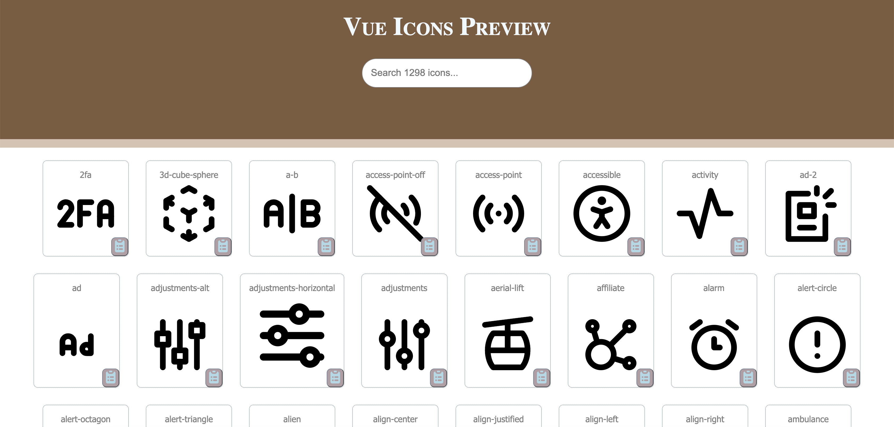

## Any-Svgicon vue cli plugin
***
### Is not an icon library, it is a tool to choose your own svg and place it in a folder you assign to compile as a sprite sheet for the svgs in use only

## Advantages :
 - easy install "No need to setup webpack configuration".
 - ready to use vue component.
 - preview for all icons locally from your command line

 ## Installation
 ```
vue add any-svgicon
 ```
 this will install, invoke the plugin and leave you with svg-icon.config.js in your root directory for any special webpack setup.


 ## Next:
-  You will be propmt to choose a folder name (relative to src/assets) to place your chosen svg icons that will be  available for you to include in your vue project "only the svg you will use in the vue component will compile in the sprite sheet.

- Add some icon files you pick to the icons folder

- clean icons width and height is optional but recommended "you control it with css later", use the following script inside icons folder
```
foreach f in `ls`;do sed -E -i '' 's/width=.{4} height=.{4}/ /' $f ;done
```
## preview your chosen icons

```
npm run icons
```
Will open up a friendly interface on port 3000 to search and choose from.


## usage:
```
<SvgIcon icon-name='whatevername'></SvgIcon>

available props:
// className:string
// outline:boolean
```
### Credits
* svg-sprite-loader
* svgo

## Licensce:
MIT 